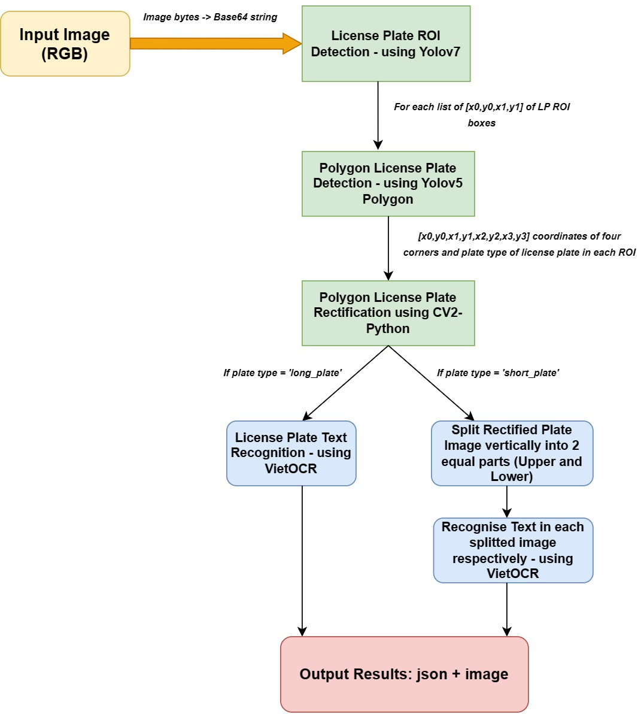
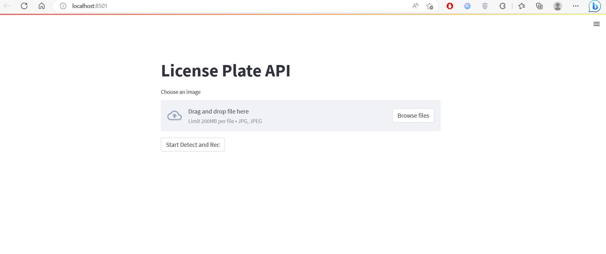
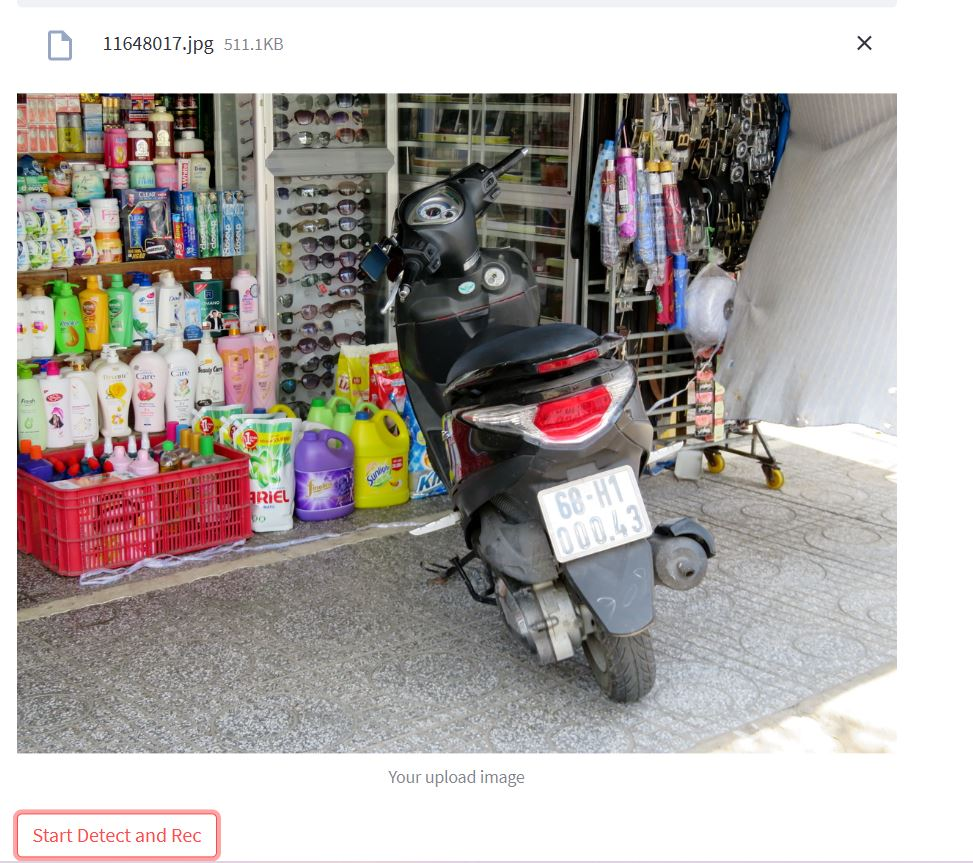
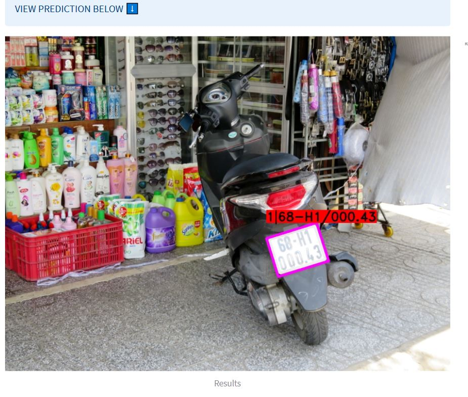
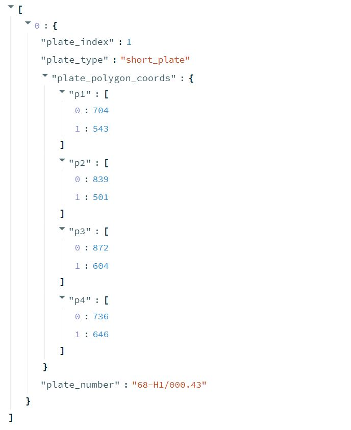

# ALPR Server 
This is the repository of the Automatic License Plate Recognition API for Vietnamese Vehicles.

## Section 1: Introduction

This project uses Yolo family model for license plate detection and VietOCR to recognise text in plates detected. We only provide local-PC scale testing, using FastAPI as backend and Streamlit library as frontend. 

Overall pipelines of whole system is shown below:



## Section 2: User Manual

### Step 1: Git clone project's repository and install requirements:
```
git clone https://github.com/btminh1820/alpr-server.git
cd alpr-server
pip install -r requirements.txt
```

### Step 2: Download all Models' Weights through GGDrive using DVC:
```
dvc pull
```

### Step 3: Run backend and frontend of API:
Backend: 
```
python ALPR_Main_API.py
```

Frontend: 
```
streamlit run front_end.py
```

### Step 4: Upload Images through local URL provided by Streamlit and test

Example:
- API frontend:


- Upload image and click on **Start Detect and Rec** button:


- Scroll down to view Results:


